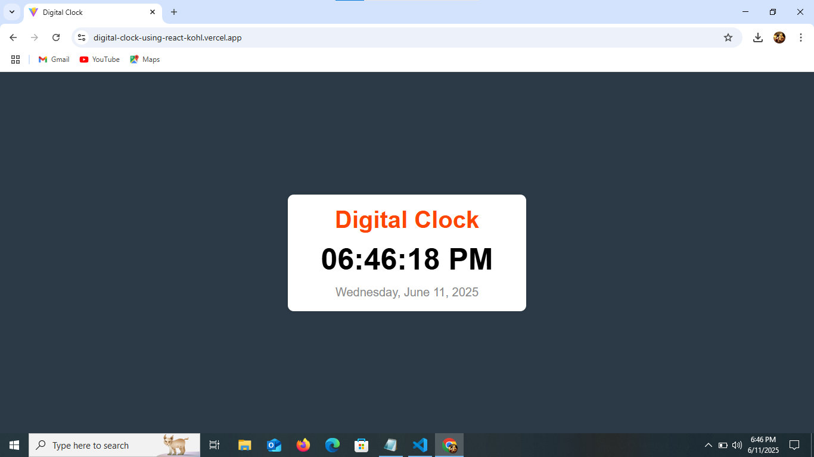

# React Digital Clock

A simple digital clock built with React that displays the current time and date in real-time.

## Live Demo

🔗 [Live Demo](https://digital-clock-using-react-kohl.vercel.app/)

## Developed By
**Gayathri G**  
GitHub: [GAYATHRI1006](https://github.com/GAYATHRI1006)

## Screenshot



## Features

- Real-time clock that updates every second  
- 12-hour format with AM/PM  
- Displays current date in a readable format  
- Clean and minimal design  

## Getting Started

### 1. Clone the Repository

```bash
git clone https://github.com/GAYATHRI1006/Digital_Clock_using_React.git
```

### 2. Install Dependencies

```bash
npm install
```

### 3. Run the App

```bash
npm run dev
```

## Tech Stack

- **React**
- **JavaScript**
- **HTML5**
- **CSS3**
